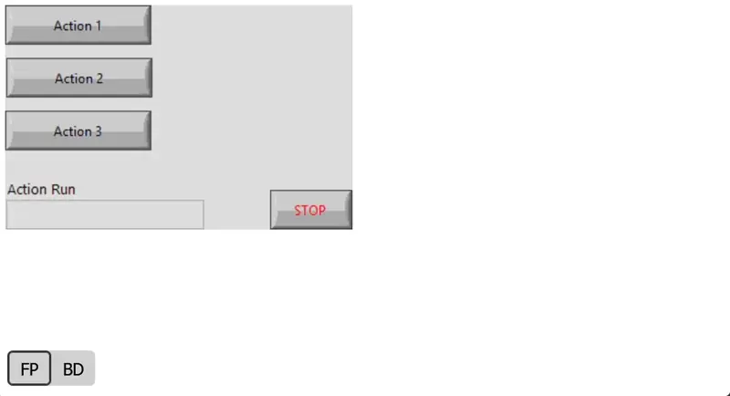

# GPreview LabVIEW

Allows you to "print" VI files into interactive HTML files with browsable multi-frame structures like case structures and event structures.

**Source is saved for LabVIEW 2019.**

Examples of interactive previews:
- [VI Data to JSON.vi](https://htmlpreview.github.io/?https://github.com/fadilf/gpreview-labview/blob/main/Test%20Cases/VI%20Data%20to%20JSON.html)
- [ControllerWorkerPattern.vit](https://htmlpreview.github.io/?https://github.com/fadilf/gpreview-labview/blob/main/Test%20Cases/ControllerWorkerPattern.html)
- [Many Nested Cases.vi](https://htmlpreview.github.io/?https://github.com/fadilf/gpreview-labview/blob/main/Test%20Cases/Many%20Nested%20Cases.html)

This tool can also be used as [VS Code extension](https://marketplace.visualstudio.com/items?itemName=fadil.gpreview) for convenience.

## Usage
`LabVIEWCLI -OperationName RunVI -PortNumber <port number> -VIPath <path to CLI.vi> <path to target VI file> <name of output HTML file> [Port Number]`

Example usage:

`LabVIEWCLI -OperationName RunVI -PortNumber 3364 -VIPath .\CLI.vi "C:\...\Test Cases\ControllerWorkerPattern 1.vi" "C:\...\Test Cases\ControllerWorkerPattern 1.html" 3363`