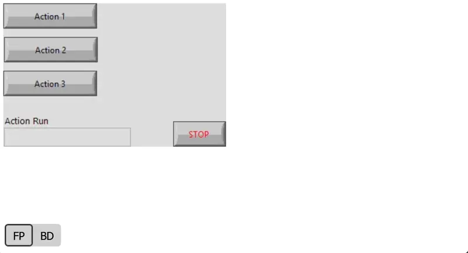

# GPreview LabVIEW



Allows you to "print" VI files into interactive HTML files with browsable multi-frame structures like case structures and event structures.

**Source is saved for LabVIEW 2019.**

Examples of interactive previews:
- [VI Data to JSON.vi](https://htmlpreview.github.io/?https://github.com/fadilf/gpreview-labview/blob/main/Test%20Cases/VI%20Data%20to%20JSON.html)
- [ControllerWorkerPattern.vit](https://htmlpreview.github.io/?https://github.com/fadilf/gpreview-labview/blob/main/Test%20Cases/ControllerWorkerPattern.html)
- [Many Nested Cases.vi](https://htmlpreview.github.io/?https://github.com/fadilf/gpreview-labview/blob/main/Test%20Cases/Many%20Nested%20Cases.html)

This tool can also be used as [VS Code extension](https://marketplace.visualstudio.com/items?itemName=fadil.gpreview) for convenience.

## Usage
### Direct from VI
By using `Generate VI HTML.vi`, you can generate the HTML output for a LabVIEW file directly. See `.\Test Cases\Run Tests.vi` for more information.

**### CLI**

**Basic syntax:**
```
LabVIEWCLI -OperationName RunVI -PortNumber <port number> -VIPath <path to CLI.vi> <optional parameters> <labview file path> <output file path>
```

**Optional parameters:**
```
[--default-tab=<FP|BD|Info>] - Sets the default tab visible when opening the preview
                               If tab is not available or this param not set, defaults to Info
[--minify]                  - Minifies the HTML output
[--disable-fp]              - Disables the front-panel tab
[--disable-bd]              - Disables the block-diagram tab
```

**Required parameters:**
- `<labview file path>` - Absolute path to vi/vim/vit/ctl file
- `<output file path>` - Absolute path to output HTML file

**Example usage:**
```
LabVIEWCLI -OperationName RunVI -PortNumber 3363 -VIPath .\CLI.vi --minify "C:\...\Test Cases\ControllerWorkerPattern.vit" "C:\...\Test Cases\ControllerWorkerPattern.html"
```